# SoC Design: 4x4 Matrix-Vector Multiplier

## 1. Specification

Design an IP to calculate the multiplication of a 4x4 matrix and a 4x1 vector. <br>
Decimal Example:
$$
\begin{bmatrix}
1 & 2 & 3 & 4 \\
5 & 6 & 7 & 8 \\
9 & 10 & 11 & 12 \\
13 & 14 & 15 & 16 \\
\end{bmatrix}

\begin{bmatrix}
1  \\
2  \\
3  \\
4  \\
\end{bmatrix}
=
\begin{bmatrix}
1*1 + 2*2 + 3*3 + 4*4 \\
5*1 + 6*2 + 7*3 + 8*4 \\
9*1 + 10*2 + 11*3 + 12*4 \\
13*1 + 14*2 + 15*3 + 16*4 \\
\end{bmatrix}
= 
\begin{bmatrix}
30 \\
70 \\
110 \\
150 \\
\end{bmatrix}
$$

Signed 32-bit Hexadecimal Example:

$$
\begin{bmatrix}
0x00000221 & 0x00000376 & 0x0000017b & 0xfffffe71 \\
0x000001c4 & 0x00000317 & 0x00000124 & 0xfffffea1 \\
0xfffffffa & 0xfffffdc5 & 0xfffffcc2 & 0xfffffd14 \\
0x000003d9 & 0x00000224 & 0xfffffde5 & 0x000002a5 \\
\end{bmatrix}
*
\begin{bmatrix}
0xffffff81 \\
0x00000133 \\
0x00000012 \\
0x0000038d \\
\end{bmatrix}
= 
\begin{bmatrix}
0xfffdaa06 \\
0xfffe0a8e \\
0xfff2bbe1 \\
0x0009e680 \\
\end{bmatrix}
$$

The block diagram shown below describes the architecture which will be applied to the design.

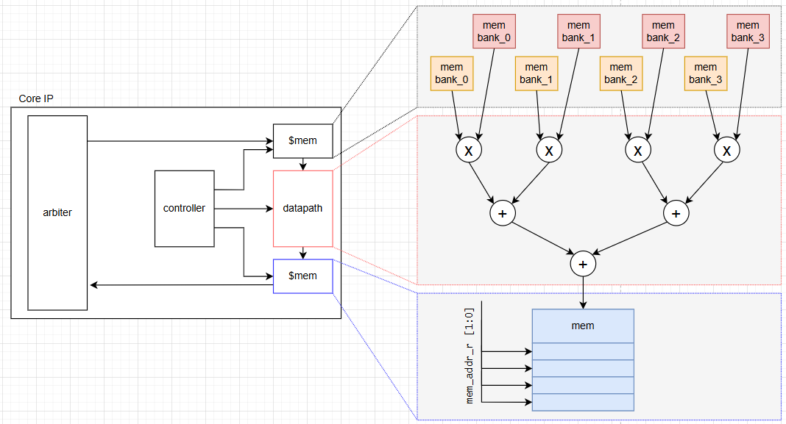  <br>

## 2. Architecture

The SoC leverages the Zynq architecture, dividing tasks between the Processing System (PS) and Programmable Logic (PL).

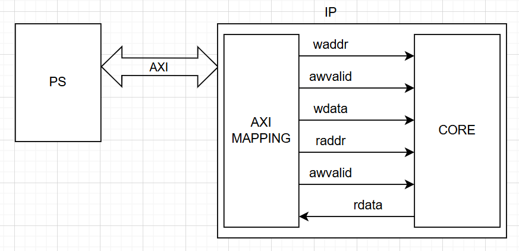

* Processing System:
   - Typically the ARM Cortex-A CPU subsystem in the Zynq KR260.
   - Runs the software stack (C/C++, Linux, or bare-metal).
   - Acts as AXI Master.

* Programmable Logic (Customized IP Hardware):
   - Contains the customized hardware logic.
   - AXI Mapping: Acts as the interface layer translating AXI bus transactions.
   - CORE IP: The custom matrix-vector multiplication logic.

## 3. Core IP Architecture

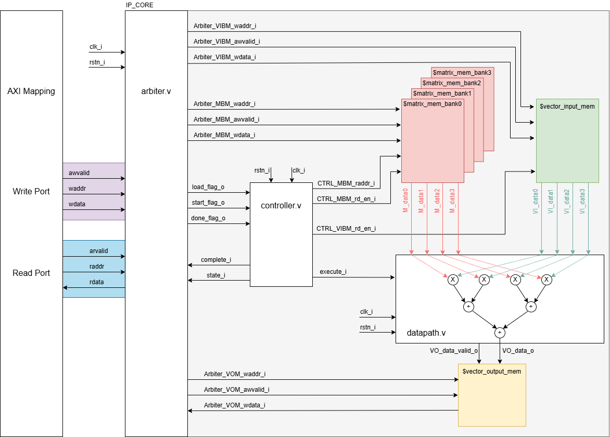  <br>

### 3.1 Datapath Block

The datapath handles the actual arithmetic execution.

* Input: 
   - `M_data_0[31:0]` to `M_data_3[31:0]` for 16 values of matrix 4x4.
   - `VI_data_0[31:0]` to `VI_data_3[31:0]` for values of vector input 4x1.
   - `execute_i` is a trigger signal to begin arithmetic calculation.
* Output:
   - `VO_data_o[31:0]` is the final calculated results.
   - `VO_data_valid_o` is a flag to indicate that `VO_data_o[31:0]` is ready to be written into the Vector Output memory.

### 3.2 Controller Block

The controller is the heart of the system, managing data flow between the arbiter, memory, and datapath via an FSM.

* Arbiter Interface:
	- Inputs: `load`, `start`, `done` (Triggered by the CPU via AXI). Controlled via `waddr_i[6:4]` where `LOAD_BASE_ADDR` = 0, `START_BASE_ADDR` = 1, `DONE_BASE_ADDR` = 2. 
	- Outputs: `complete`, `state` (Read by the CPU to monitor FSM status).
* Matrix Memory Interface:
	- Input: `CTRL_MBM_raddr`, `CTRL_MBM_rd_en`
	- Reads simultaneously all index[0] value of 4x banks. Each bank has 4x registers index[0] -> index[1].
* Vector Input Memory Interface:
	- Input: `CTRL_VIBM_rd_en`
	- Reads simultaneously all 4 values of 4x banks in. Each bank only one register index[0].
* Datapath Interface:
	- Signals: `execute` (triggers computation).

Controller FSM State Machine:

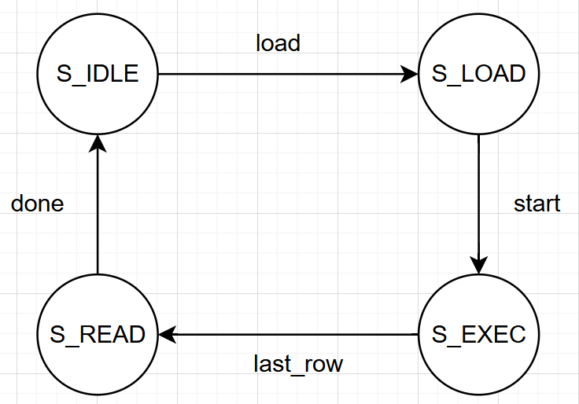  <br>

### 3.3 Memory Organization

#### 3.3.1. Matrix Memory Bank (4x4)

Because the matrix holds 16 values, it is distributed across 4 parallel memory banks (representing columns), with a depth of 4 registers each (representing rows). <br>
A 4-bit address (addr_i[3:0]) is required:

- `bank_select_w [1:0]` = `addr_i[1:0]` to select the memory bank.
- `mem_bank_addr_w [1:0]` = `addr_i[3:2]` to select the register depth of the memory bank.
- Example: If `addr_i[3:0]` = `4'b1101`, it targets depth `3` (`2'b11`) and the bank `1` (`2'b01`), yielding `0x00000224`.

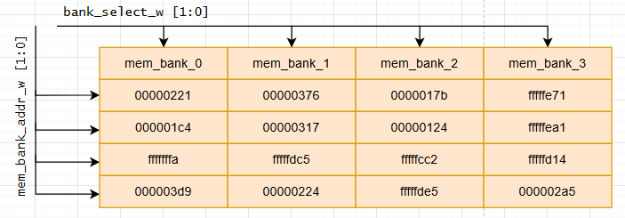  <br>
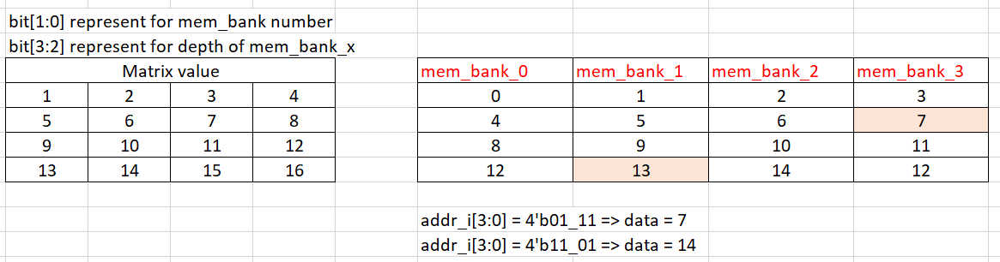  <br>

#### 3.3.2. Vector Input Memory Bank (4x1)

The 4x1 input vector only requires 4 total values. It utilizes 4 banks with a depth of just 1 register each.
- `bank_select_w [1:0]` = `addr_i[1:0]` to select the memory bank.
- Example: If `addr_i[1:0]` = `2'b01`, yielding `0x00000133`.

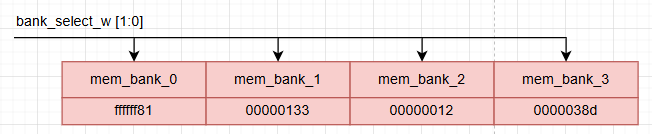  <br>

#### 3.3.3. Vector Output Memory (4x1)

The execution result is a 4x1 vector. This is stored in a single memory block with a depth of 4.
-  `mem_addr_r[1:0]` accesses the 4 calculated results.

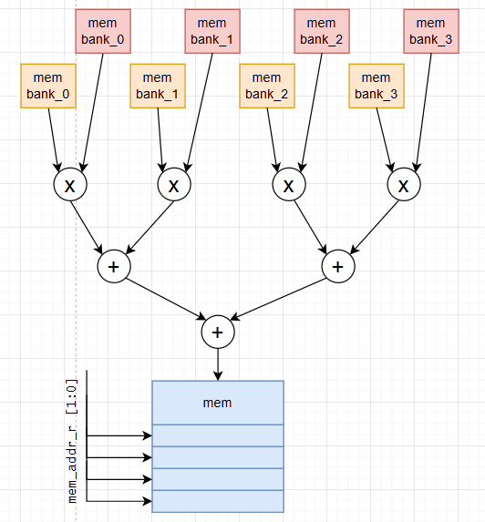  <br>

## 4. Address Mapping & Loading Sequence

To load data into the system, a 7-bit write address (`waddr_i[6:0]`) is utilized:
* Base Address (`waddr_i[6:4]`): Routes the data to the correct module.
	- `011`: `Matrix Memory Base` = 3
	- `100`: `Vector Input Base`  = 4
* Target Mapping (`waddr_i[3:0]`): Bits `[3:2]` determine the Register/Depth, and bits `[1:0]` determine the Bank.

### 4.1 Write Sequence (CPU to IP)

| Base `[6:4]` | Reg `[3:2]` | Bank `[1:0]` | Full Address `waddr_i[6:0]` | Target Destination |
| :--- | :--- | :--- | :--- | :--- |
| `011` | `00` | `00` | `011_00_00` | Matrix Memory — Bank 0, Reg 0 |
| `011` | `00` | `01` | `011_00_01` | Matrix Memory — Bank 1, Reg 0 |
| `011` | `00` | `10` | `011_00_10` | Matrix Memory — Bank 2, Reg 0 |
| `011` | `00` | `11` | `011_00_11` | Matrix Memory — Bank 3, Reg 0 |
| `011` | `01` | `00` | `011_01_00` | Matrix Memory — Bank 0, Reg 1 |
| `...` | `...` | `...` | `...` | *(Pattern continues through `011_11_11` for Reg 3)* |
| `100` | `00` | `00` | `100_00_00` | Vector Input Memory — Bank 0 |
| `100` | `00` | `01` | `100_00_01` | Vector Input Memory — Bank 1 |
| `100` | `00` | `10` | `100_00_10` | Vector Input Memory — Bank 2 |
| `100` | `00` | `11` | `100_00_11` | Vector Input Memory — Bank 3 |

### 4.2 Read Sequence (IP to CPU)

To retrieve the calculated results, the CPU polls the status bit `rdata_o[0]`.

- If `rdata_o[0] == 1`: The Execute state is complete, and the Vector Output memory is ready.
- The CPU then reads using a 3-bit read address (`raddr_i[2:0]`), where the MSB (`raddr_i[2]`) acts as the Output Base Address.

| Address `raddr_i[2:0]` | Target Data |
| :--- | :--- |
| `100` | Read `rdata_o` from Vector Output, Register 0 |
| `101` | Read `rdata_o` from Vector Output, Register 1 |
| `110` | Read `rdata_o` from Vector Output, Register 2 |
| `111` | Read `rdata_o` from Vector Output, Register 3 |


## 5. IP Packaging & AXI Integration

Once the pure Verilog hardware design is complete, it must be packaged into a standard IP block to interface with the PS via the AXI-Lite bus.


Within the generated wrapper file `Matrix_Vector_IP_v1_0_S00_AXI.v`, the custom module `Matrix_Vector_4x4_Core` must be instantiated and properly wired to the AXI registers, ensuring the memory mapped addresses translate directly to the `waddr_i` and `raddr_i`.

```verilog
	// User space
	parameter DWIDTH  = 32;
    parameter WAWIDTH = 7;
    parameter RAWIDTH = 3;
    parameter MAWIDTH = 4;
    parameter VAWIDTH = 2;
	// Wire declaration
    wire                    awvalid_i_w;
    wire [WAWIDTH-1:0]      waddr_i_w;
    wire [DWIDTH-1:0]       wdata_i_w;

    wire                    arvalid_i_w;
    wire [RAWIDTH-1:0]      raddr_i_w;
    wire [DWIDTH-1:0]       rdata_o_w;

	// Combination circuit for data out
	always @(*) begin
		axi_rdata   = rdata_o_w;
	end
    
	// Add user logic here
	assign awvalid_i_w = slv_reg_wren;
	assign waddr_i_w   = axi_awaddr[WAWIDTH+ADDR_LSB-1:ADDR_LSB];
	assign wdata_i_w   = S_AXI_WDATA;
	
	assign arvalid_i_w = slv_reg_rden;
	assign raddr_i_w   = axi_araddr[RAWIDTH+ADDR_LSB-1:ADDR_LSB];
	
	Matrix_Vector_4x4_Core #(
        .DATA_WIDTH (DWIDTH),
        .WA_WIDTH	(WAWIDTH),
        .RA_WIDTH	(RAWIDTH),
        .MA_WIDTH	(MAWIDTH),
        .VA_WIDTH	(VAWIDTH)
    ) matrix_vector_core (
        .clk_i      (S_AXI_ACLK),
        .rstn_i     (S_AXI_ARESETN),
        .awvalid_i  (awvalid_i_w),
        .waddr_i    (waddr_i_w),
        .wdata_i    (wdata_i_w),
        .arvalid_i  (arvalid_i_w),
        .raddr_i    (raddr_i_w),
        .rdata_o    (rdata_o_w)
    );
```

Set Parameter for Data Width and Adress Width in `Matrix_Vector_IP_v1_0.v` and `Matrix_Vector_IP_v1_0_S00_AXI.v`
- At `Matrix_Vector_IP_v1_0.v`:
```verilog
	// Parameters of Axi Slave Bus Interface S00_AXI
	parameter integer C_S00_AXI_DATA_WIDTH	= 32,
	parameter integer C_S00_AXI_ADDR_WIDTH	= 32
```
- At `Matrix_Vector_IP_v1_0_S00_AXI.v`:
```verilog
	// Width of S_AXI data bus
	parameter integer C_S_AXI_DATA_WIDTH	= 32,
	// Width of S_AXI address bus
	parameter integer C_S_AXI_ADDR_WIDTH	= 32
```
Then, we need to follow the flow design below:
1. Package IP and generate output product by using Vivado tool.
2. Create wrapper.
3. Creat block design.

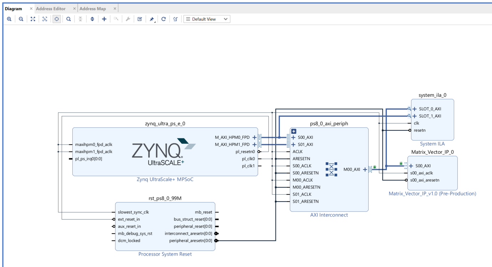  <br>

## 6. Running Testbench & Implemting on FPGA

* Generate the bitsteeam file and program to FPGA KR260 Board.
```shell
    # SSH to Board
    # Running as Admin
    sudo su
    sh load_bitsteam.sh
    exit
    # Compile main.c file to run the program
    gcc -o main main.c
    ./main
```

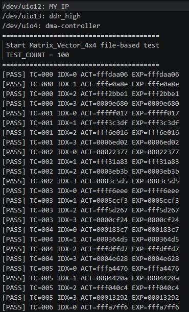  <br>
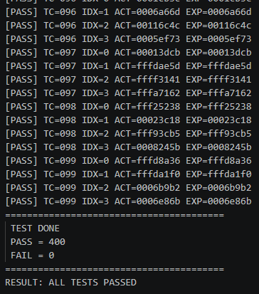  <br>


* Using `devmem2` cmd to write/read directly memory.
```shell
# Procedure
# Write Load flag 
sudo devmem2 0xA0000000 w 0x00000001

# Write Matrix memory
sudo devmem2 0xA00000C0 w 0x00000221
sudo devmem2 0xA00000C4 w 0x00000376
sudo devmem2 0xA00000C8 w 0x0000017b
sudo devmem2 0xA00000CC w 0xfffffe71
sudo devmem2 0xA00000D0 w 0x000001c4
sudo devmem2 0xA00000D4 w 0x00000317
sudo devmem2 0xA00000D8 w 0x00000124
sudo devmem2 0xA00000DC w 0xfffffea1
sudo devmem2 0xA00000E0 w 0xfffffffa
sudo devmem2 0xA00000E4 w 0xfffffdc5
sudo devmem2 0xA00000E8 w 0xfffffcc2
sudo devmem2 0xA00000EC w 0xfffffd14
sudo devmem2 0xA00000F0 w 0x000003d9
sudo devmem2 0xA00000F4 w 0x00000224
sudo devmem2 0xA00000F8 w 0xfffffde5
sudo devmem2 0xA00000FC w 0x000002a5

# Write Vector memory
sudo devmem2 0xA0000100 w 0xffffff81
sudo devmem2 0xA0000104 w 0x00000133
sudo devmem2 0xA0000108 w 0x00000012
sudo devmem2 0xA000010C w 0x0000038d

# Write Start flag
sudo devmem2 0xA0000040 w 0x00000001

sudo devmem2 0xA0000010 w
sudo devmem2 0xA0000014 w
sudo devmem2 0xA0000018 w
sudo devmem2 0xA000001C w

# Read data
sudo devmem2 0xA0000080 w 0x00000001
```
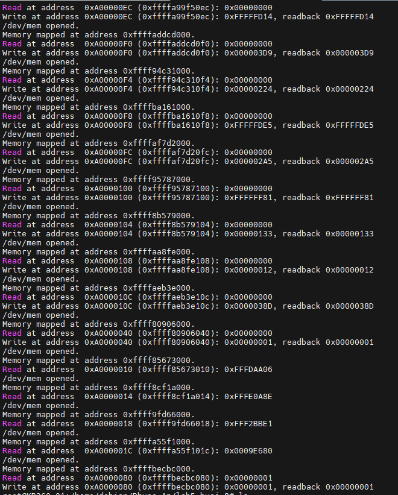  <br>

The results of two methods are the same. The design passed 100 test cases.  
Verification  
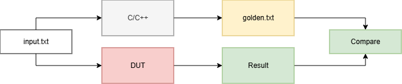  <br>


# Project Structure


├── c/                   # check results by using code c  
├── rtl/                 # RTL design (Verilog & IP)  
├── docs/                # Documentation (design notes, diagrams)  
├── Embedded_SW_UIO/     # Embedded software (UIO driver / user-space control)  
├── images/              # Images used in README or documentation  
└── README.md            # Project description  

---